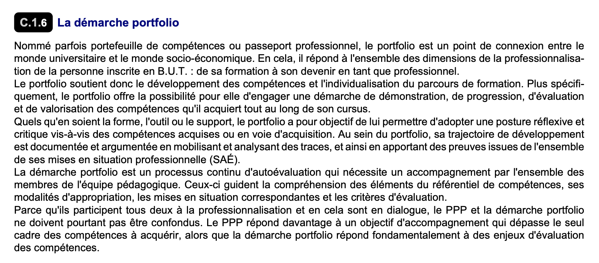

//------------------------------------
// GOALS book
//
// Template for requirement:
//---- Requirement
//[[gx-keyword]] 
//`{counter:gx}`
// Requirement

// {missing} [Corresponding Artifact]
//---- 
//------------------------------------

ifndef::part[]
:part:
include::definitions.adoc[]
endif::[]

== Goals

.Front matter
[TIP]
====
// Title (whether or not on a separate title page).
// Date of current publication and revision history.
// Table of contents and any other appropriate tables, such as a table of illustrations. (But not the glossary, which is part of the contents, as section E.1.)
toc::[] 
// Copyright notice, distribution information, restrictions on distribution.
// Approval information. 
====

=== G.1 Context and overall objective

The new French diploma, BUT (Bachelor Universitaire de Technologie) includes the important notion of Portfolio.

Here is a translation of the link:{myfiles}/pn2021.pdf[original specification] (C.1.6, p.15), also illustrated in the <<original,following figure>>:

.....
Sometimes referred to as the skills portfolio or professional passport, the portfolio is a connection point between academia and the socio-economic world. It responds to all the dimensions of the professionalization of a BUT student: from training to becoming a professional.
The portfolio, therefore, supports the development of skills and the individualization of the training courses. More specifically, the portfolio allows the student to initiate a demonstration, progression, evaluation, and enhancement of the skills that she acquires throughout her course.
Whatever the form, tool, or medium, the portfolio's objective is to enable it to adopt a reflective and critical posture vis-à-vis the skills acquired or in the process of being acquired. Within the portfolio, his development trajectory is documented and argued by mobilizing and analyzing traces. It also provides evidence from all of his professional skills.
The portfolio approach is a continuous self-assessment process that requires support from all members of the teaching team. These guide the understanding of the elements of the skills framework, its appropriation methods, the corresponding scenarios, and the evaluation criteria.
The portfolio approach fundamentally responds to skills assessment issues.
.....

.Original (French) specification of the Portfolio usage

=== G.2 Current situation

{emptysec}

=== G.3 Expected benefits 

{emptysec}

=== G.4 Functionality overview

//---- Requirement
[[g4-phys-intrusion]]
`{counter:g4}`
The {system} must ...
//---- 

=== G.5 High-level usage scenarios 

{emptysec}

=== G.6 Limitations and exclusions 

{emptysec}

[[g7-]]
=== G.7 Stakeholders and requirements sources

Here is a non-exhaustive list of the stakeholders.

//----------------------------------------------
.Target side stakeholders
[cols="1,1,3",,options="header"]
|===
| Stakeholder | Category | Comment 
//----------------------------------------------
| [[g7-bob]]Bob | User | Main user of the {system} ...
|=== 
//----------------------------------------------

//----------------------------------------------
.Production side stakeholders
[cols="1,1,3",,options="header"]
|===
| Stakeholder    | Category | Comment 
//----------------------------------------------
| System Admin | Technical department | ...
|===
//----------------------------------------------

// .Back matter
// [TIP]
// ====
// // Title (whether or not on a separate title page).
// // Date of current publication and revision history.
// // Table of contents and any other appropriate tables, such as a table of illustrations. (But not the
// // glossary, which is part of the contents, as section E.1.)
// // Copyright notice, distribution information, restrictions on distribution.
// // Approval information. 
// // TBD list:: <<ref>>.
// ====
