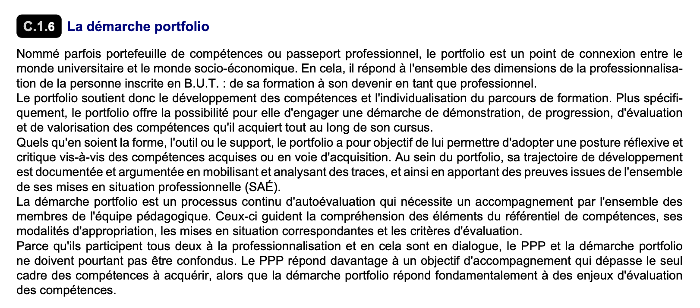

= BUT Portfolio 
//------------------------- configuration
:icons: font
:toc:
:numbered:
:favicon: images/pegs.png

:github-repo: https://github.com/FormalRequirements/portfolioRequirements
:github-io: https://FormalRequirements.github.io/portfolioRequirements
:myfiles: {github-repo}/blob/master/resources

:hb-pdf: http://se.ethz.ch/~meyer/down/requirements_handbook/REQUIREMENTS.pdf
:hb-title: Handbook of requirements and business analysis
:hb-url: http://requirements-handbook.org/

// icons for GitHub
ifdef::env-github[]
:tip-caption: :bulb:
:note-caption: :information_source:
:important-caption: :heavy_exclamation_mark:
:caution-caption: :fire:
:warning-caption: :warning:
endif::[]
//-------------------------------------

ifndef::pdf-backend[]
//------------------------------------ Badges --------
//image:https://github.com/FormalRequirements/requirements-handbook/workflows/Check%20Markdown%20links/badge.svg[Check Markdown links,link="https://github.com/FormalRequirements/requirements-handbook/actions"]
image:https://github.com/FormalRequirements/portfolioRequirements/actions/workflows/bdd.yml/badge.svg[Tests, link="https://github.com/FormalRequirements/portfolioRequirements/actions/workflows/bdd.yml"]
image:https://img.shields.io/badge/License-MIT-yellow.svg[License: MIT, link="https://opensource.org/licenses/MIT"]
image:https://img.shields.io/badge/Gitpod-ready--to--code-blue?logo=gitpod[Gitpod ready-to-code ,link="https://gitpod.io/#https://github.com/FormalRequirements/portfolioRequirements"]
image:https://img.shields.io/badge/PDF-Download-blue[PDF download,link="https://github.com/FormalRequirements/portfolioRequirements/blob/main/main.pdf"]
//------------------------------------ Badges --------
endif::[]

WARNING: Work in progress!

This repository constitutes the requirements of the BUT portfolio, following the approach described in the book: link:{hb-pdf}[{hb-title}].

The requirements book can be found in several forms:

- The requirements themselves in plain text (link:main.adoc[])
- The corresponding PDF generated version (link:main.pdf[])
- The corresponding HTML generated version ({github-io})

== What is a portfolio?

The new French diploma, BUT (Bachelor Universitaire de Technologie) includes the important notion of Portfolio.

Here is a translation of the link:{myfiles}/pn2021.pdf[original specification] (C.1.6, p.15), also illustrated in the <<original,following figure>>:

.....
Sometimes referred to as the skills portfolio or professional passport, the portfolio is a connection point between academia and the socio-economic world. It responds to all the dimensions of the professionalization of a BUT student: from training to becoming a professional.
The portfolio, therefore, supports the development of skills and the individualization of the training courses. More specifically, the portfolio allows the student to initiate a demonstration, progression, evaluation, and enhancement of the skills that she acquires throughout her course.
Whatever the form, tool, or medium, the portfolio's objective is to enable it to adopt a reflective and critical posture vis-à-vis the skills acquired or in the process of being acquired. Within the portfolio, his development trajectory is documented and argued by mobilizing and analyzing traces. It also provides evidence from all of his professional skills.
The portfolio approach is a continuous self-assessment process that requires support from all members of the teaching team. These guide the understanding of the elements of the skills framework, its appropriation methods, the corresponding scenarios, and the evaluation criteria.
The portfolio approach fundamentally responds to skills assessment issues.
.....

.Original (French) specification of the Portfolio usage
